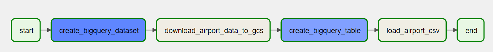
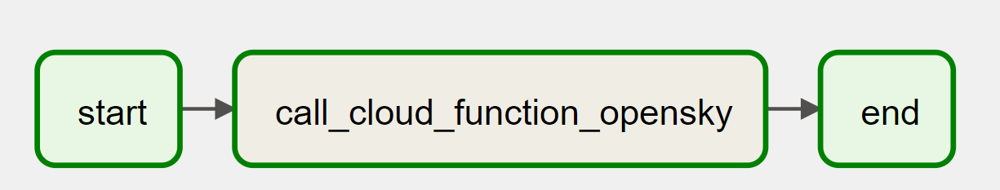
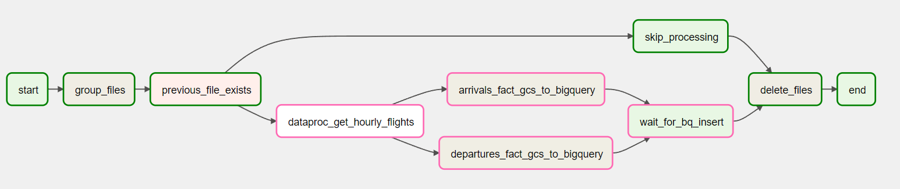

# Workflows (Cloud composer)

All the workflows are scheduled using Google Cloud composer (Airflow).The DAGs executed in this project are located in the [**dags**](./dags/) directory.

## [Create_BigQuery_dataset](./dags/create_bigquery_dataset.py)

### Description

This DAG is designed to create a BigQuery dataset, an empty table, and upload airport data into BigQuery from a CSV file. This DAG is scheduled to run once when creating the project.

### Configuration

- **Schedule Interval:** Once
- **DAG Run Timeout:** 15 minutes
- **Tags:** once

## Tasks

1. **start:** An empty task to mark the beginning of the DAG.
2. **create_bigquery_dataset:** Creates a BigQuery dataset named "flights" if it doesn't exist.
3. **download_airport_data_to_gcs:** Downloads airport data using the [url_to_bucket](./cloud_functions/url_to_bucket/) cloud function to download airport data from https://davidmegginson.github.io/ourairports-data/airports.csv and stores it in GCS.
4. **create_bigquery_table:** Creates a BigQuery table named "flights_fact" if it doesn't exist, with the specified [schema](./dags/schemas/schemas.py).
5. **load_airport_csv:** Loads airport data downloaded in the previous task from GCS to BigQuery.
6. **end:** An empty task to mark the end of the DAG.

## Workflow

- Start the DAG -> Create BigQuery dataset -> Download airport data to GCS -> Create BigQuery table -> Load airport data to BigQuery -> End the DAG.

  

## [openskyAPI_to_GCS](./dags/openskyAPI_to_GCS.py)

### Description

This DAG is designed to retrieve current flight positions from [The OpenSky Network](https://opensky-network.org) and store the data in Google Cloud Storage. The DAG runs at a 2-minute interval, making it suitable for near-real-time data updates.

### Configuration

- **Schedule Interval:** Every two minutes
- **DAG Run Timeout:** 1 minute
- **Tags:** minute

### Tasks

1. **start:** An empty task to mark the beginning of the DAG.
2. **call_cloud_function_opensky:** Calls the [openskynet_pos](./cloud_functions/openskynet_pos/) cloud function responsible for fetching data from the API to get current flight positions and stores the data in GCS.
3. **end:** An empty task to mark the end of the DAG.

### Workflow

- Start the DAG -> Call OpenSky API -> Store data in GCS -> End the DAG.

  

### Bash Operator Command

```bash
curl -m 70 -X POST https://europe-southwest1-flights-de.cloudfunctions.net/openskynet_pos \
-H "Authorization: bearer $(gcloud auth print-identity-token)" \
-H "Content-Type: application/json"
```

## [group_hourly_toBQ](./dags/group_hourly_toBQ.py)

### Description

This DAG processes hourly flight data, extracts departures and arrivals using a Dataproc script, uploads the results to BigQuery and deletes unnecesary files.

### Configuration

- **Schedule Interval:** Every 10th minute of the hour
- **DAG Run Timeout:** 35 minutes
- **Tags:** hourly

### Tasks

1. **start:** An empty task to mark the beginning of the DAG.
2. **group_files:** Groups hourly flight data files in the specified bucket.
3. **previous_file_exists:** Checks if the previous file needed for dataproc exists.
4. **skip_processing:** Skips processing if it is not the first hour run.
5. **dataproc_operator:** Submits the [departures and arrivals](./dataproc_scripts/departures_arrivals_csv.py) dataproc job to transform data points into departures and arrivals.
6. **gcs_to_bq_departures:** Uploads hourly departures data to BigQuery.
7. **gcs_to_bq_arrivals:** Uploads hourly arrivals data to BigQuery.
8. **wait_for_bq_insert:** An empty task to wait for BigQuery insertion completion.
9. **delete_old_files:** Deletes old files from the specified bucket leaving only the grouped file.
10. **end:** An empty task to mark the end of the DAG.

### Workflow

- If previous file is available:
  - Group files -> Execute Dataproc job -> Upload to BigQuery -> Wait for insertion completion -> Delete old files.
- If it is not available:

  - Group files -> Skip processing -> Delete old files.

  
